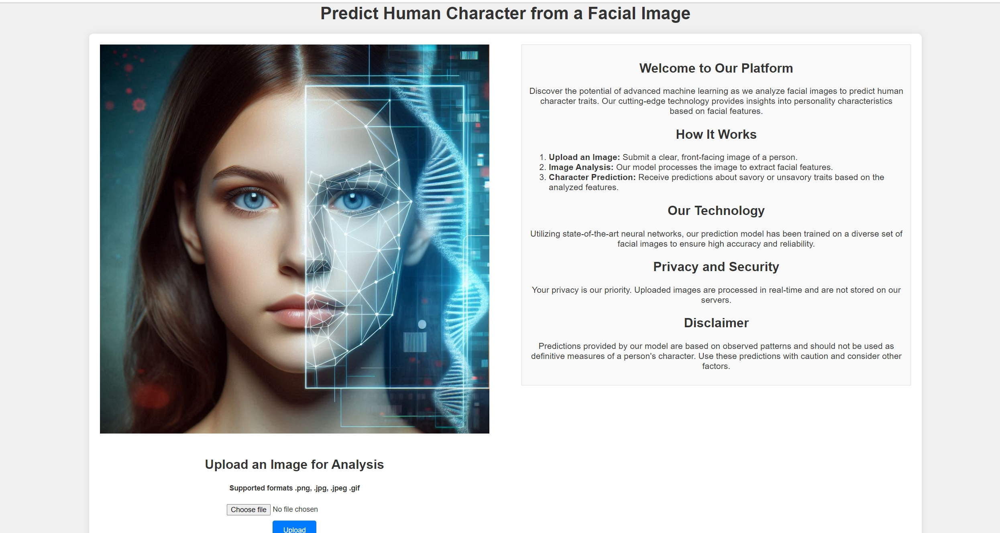
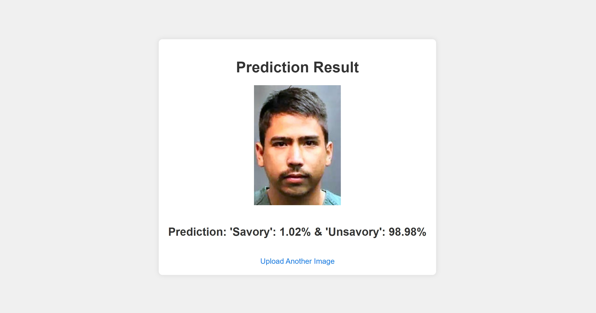

# Human Character Predict

All data in this dataset was gathered from PUBLICLY accessible web sites or databases .This dataset consists of 2 classes, savory and unsavory. The unsavory class is populate with i facial mages of convicted felons. The savory class is populated with facial images of "ordinary" people. Granted some "ordinary" people may be convicted felon but I expect the percentage is very low. All downloaded images were processed by a custom duplicate image detector before being split into a train set, a validation set and a test set. This is meant to prevent images being in common between these data sets. All images were cropped from the original downloaded image to just a facial image using the MTCNN crop module. The crop is such that very little extraneous background is included in the cropped image. This is to prevent the CNN classifier from extracting background features not relevant to the task of classification from a facial image. The train set has 5610 images in the savory class and 5610 images in the unsavory class. The test set has 300 images in the savory class and 300 images in the unsavory class as does the validation set.

[Link to Dataset](https://www.kaggle.com/datasets/gpiosenka/good-guysbad-guys-image-data-set)

[Link to my Google Colab](https://colab.research.google.com/drive/11_KAu0cjFBxKzSXJ_JhhXKF6vSQV_mPt?usp=sharing)

## Installing using GitHub:

```
git clone git@github.com:MKeSiMu/human-character-predict.git
python -m venv venv
source venv/bin/activate
pip install -r requirements.txt
create .env file and set SECRET_KEY=<your secret key>
flask run
```

## Disclaimer:

Predictions provided by our model are based on observed patterns and should not be used as definitive measures of a person's character. Use these predictions with caution and consider other factors.

## Demo



